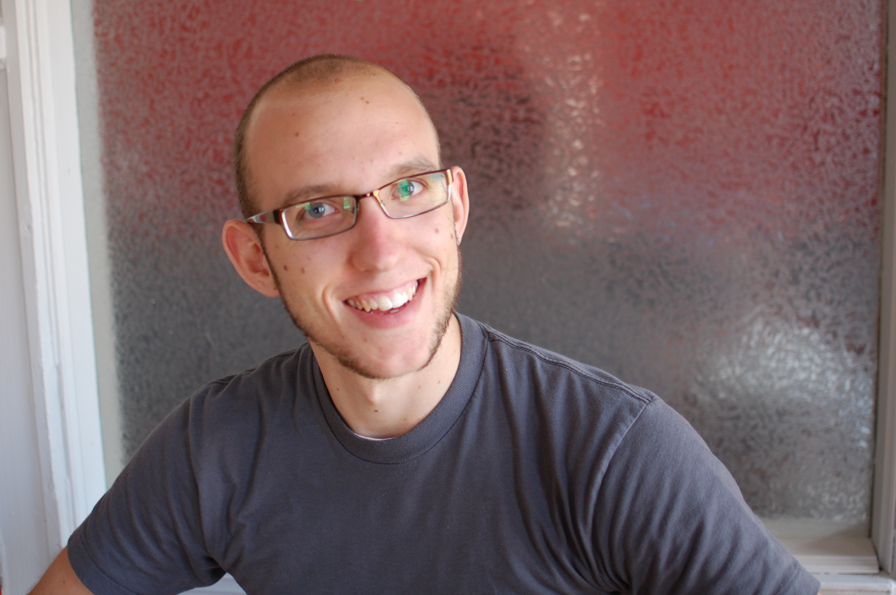
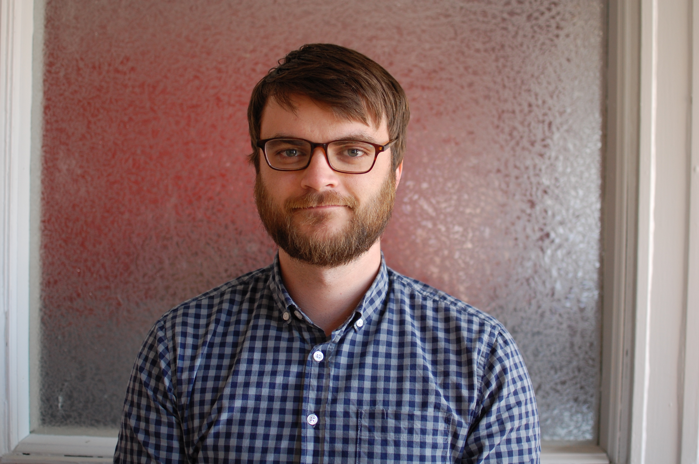
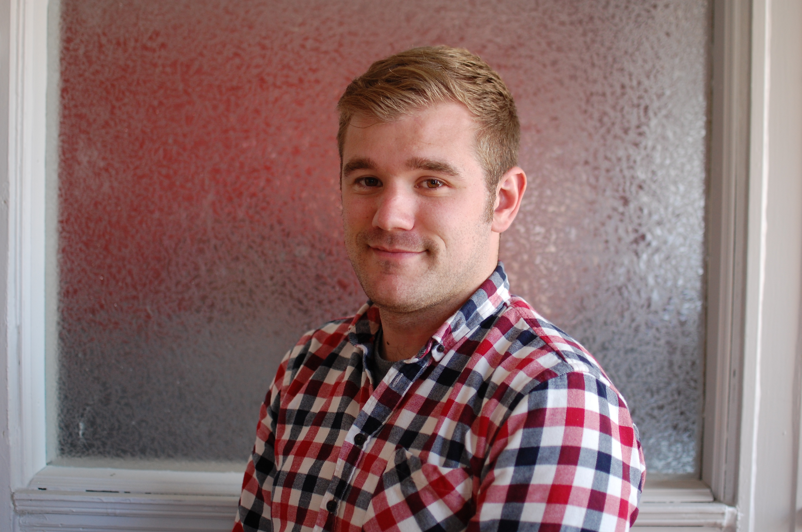
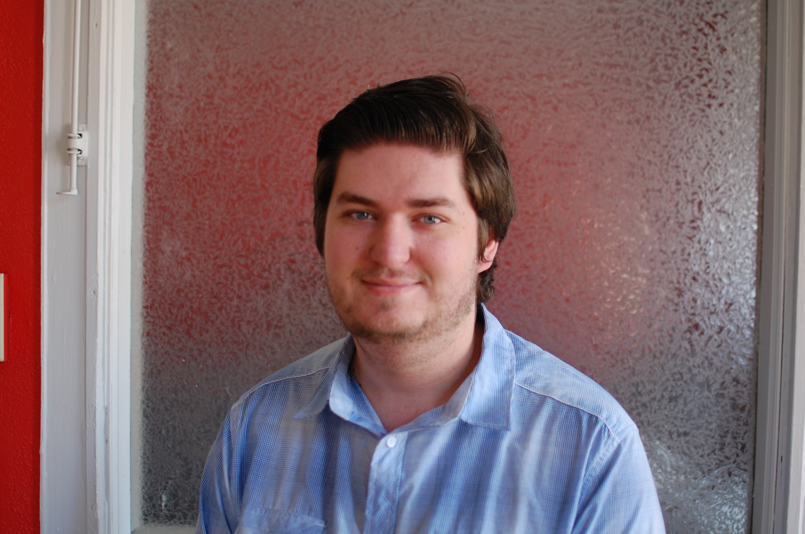
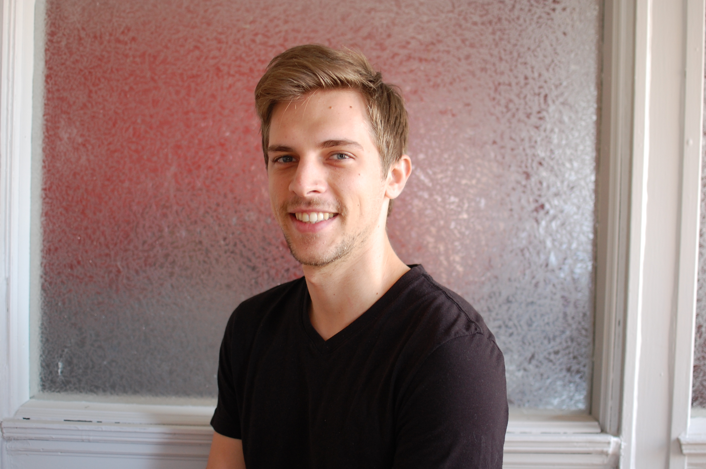
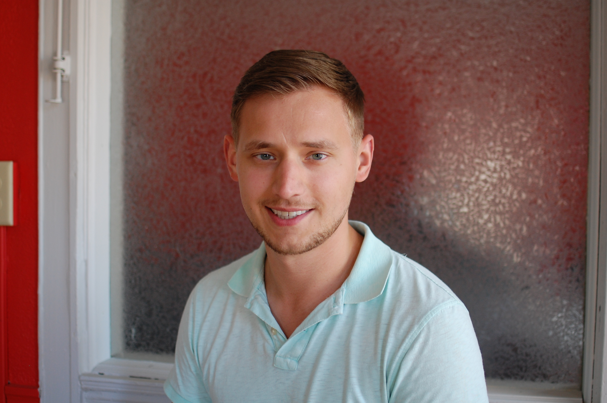
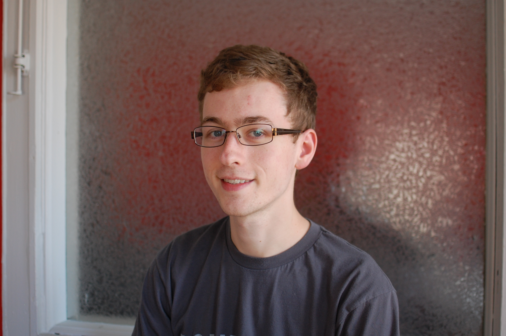

# Team

## Josh Holtz - Partner, iOS Development

Josh is one of the founding partners, and the first ever employee of RokkinCat. 
He is our resident iOS expert, having built production level applications in 
Objective-C, Swift, and Swift 2. He also is a core contributor to the 
[Fastlane](https://fastlane.tools/) mobile build automation tool suite. Find him
on [GitHub](https://github.com/joshdholtz) or [Twitter](https://twitter.com/joshdholtz).

## Rick Allen - Partner, Front-End Development

Rick is one of the founding partners of RokkinCat. He oversees all development 
which happens in browsers, that includes web applications as well as hybrid
mobile applications. He is the creator of the [Falcon.JS](https://stoodder.github.io/falconjs/)
MVVM framework. In addition to his development prowess, Rick has been at the helm
of both of RokkinCat's entrepreneurial efforts: Tappr and [Comet](https://www.comet.ai). 
Find him on [GitHub](https://github.com/stoodder) and [Twitter](https://twitter.com/stoodder).

## Jason Stiebs - Partner, API Development

Jason is one of the founding partners of RokkinCat. All API development and server 
application projects go through him. As a core contributor of the 
[Phoenix Web Framework](https://www.phoenixframework.com) and the
creator of the [Elixir](https://elixir-lang.org) implementation of [JSONAPI](http://jsonapi.org),
he has a lot of practice making sure applications built by RokkinCat are fast
and reliable. Talk to him on [GitHub](https://github.com/jeregrine) and 
[Twitter](https://twitter.com/peregrine) or any of the _many_ IRC channels he hangs out in.

## Nick Gartmann - Partner, Sales, Development

Nick is one of the founding partners of RokkinCat. He helps perspective clients
understand what the true technology needs are so they spend money on the _right_
stuff. He also builds applications in as many technologies as possible so as
to better understand the technology options availble to RokkinCat's clients. You can
find him on [GitHub](https://github.com/nickgartmann), [Twitter](https://twitter.com/nickgartmann),
and [LinkedIn](https://www.linkedin.com/in/nickgartmann)

## Greg Billetdeaux - Android Development

Greg is in charge of all of RokkinCat's Android app development. Greg has been doing
Android development since the very earliest releases of Android and developed one of
the most popular [sidebar navigation libraries](https://github.com/Gregadeaux/android-fly-in-app-navigation) for Android 
while he was still in school. He is also a coach of First Robitics team 930. Learn 
more about him on [GitHub](https://github.com/gregadeaux) and [Twitter](https://twitter.com/gregadeaux).

## Mitch Henke - API Development, Search Specialist

Mitch is one of RokkinCat's most methodical engineers.
He works on the servers of our largest applications, making sure they are fast and resiliant, and that they will stay that way no matter how many users get thrown at them.
If you check out his [GitHub](https://github.com/mitchellhenke) you'll see a long list of repos that he has forked and fixed.
Ask him about [Elastic search](https://www.elastic.co) on [Twitter](https://twitter.com/mitchellhenke).

## Alex Solo - Full Stack Development

Alex is in charge of RokkinCat's Seattle branch, and a full stack force to be reckoned with.
He has worked extensively on hybrid mobile applications and web applications for us and we have never seen so much quality code happen so quickly. 
Check out his [GitHub](https://github.com/civilframe) for a fantastic selection of applications he has built, pay special attention to the ones using [MeteorJS](https://www.meteor.com/). 
Ask him how he does it on [Twitter](https://twitter.com/civilframe).

## Jake Robers - Engineering Intern

Jake is a junior software engineer at the Milwaukee School of Engineering, and has been an intern at RokkinCat for 1 year. 
He has a great eye for product development, and has been focusing his study around AngularJS, Elixir, and machine learning.
Jake has also taken a great interest in developer-focused UX, follow him on [Twitter](https://twitter.com/jake_robers) to hear him complain about bad frameworks, and check out his [GitHub](https://github.com/jakerobers) to hear him show how to fix it.

## Lyzzi Brooks - Engineering Intern

Lyzzi is a senior software engineer at the Milwaukee School of Engineering, and the newest employee at RokkinCat.
She is our resident video game designer and developer and has built many games using the Unity framework. 
As the head of the MSOE Video Game Development Group, she has worked on teams to build a bunch of games (which you can find on her [GitHub](https://github.com/brookse)).
She does NodeJS and iOS development in addition to her more fun capabilities. 
Head to [Twitter](https://twitter.com/lyzzi_lightyear) to read her thoughts on programming, gaming, knitting, music, and the internet in general.
